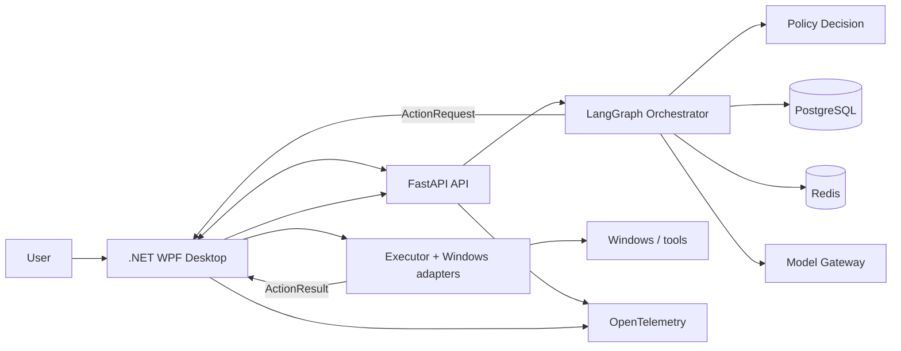

# System Architecture

## Trust boundaries

1. User ↔ desktop: authenticated interactive session.
2. Desktop ↔ backend: loopback by default, mutually authenticated, origin checked.
3. Reasoning ↔ execution: all model output is untrusted until schema and policy validation.
4. Host ↔ Windows: least-privilege adapters; elevation is a separate visible flow.
5. Local ↔ cloud: egress policy, consent, redaction, and provider-specific retention controls.

## Deployment shape

Start as two processes:

- `Jarvis.Desktop.exe`: WPF UI, device identity, capability broker, policy enforcement, native adapters, local audit spool.
- `jarvis-api`: FastAPI, LangGraph, planning, memory, provider gateway, scheduling, and durable task state.

PostgreSQL stores business and checkpoint data. Redis is optional for ephemeral fan-out, rate limits, and leases—not the system of record. Blob storage holds encrypted artifacts with retention metadata.

## Core sequence

1. Desktop submits a request with a task and correlation ID.
2. Graph classifies and gathers bounded context.
3. Planner produces typed actions.
4. Policy evaluates every action.
5. `ask` actions interrupt durably and emit approval cards.
6. Executor revalidates the approved action digest and runs it.
7. Results are appended to the task event stream.
8. Verifier checks postconditions; responder summarizes evidence.

## Failure containment

Provider failures cannot grant authority. Backend loss cannot cause the desktop to execute queued prose. Desktop loss leaves actions pending. A mismatched contract, expired approval, unknown capability, stale plan, or duplicate idempotency key fails closed.
