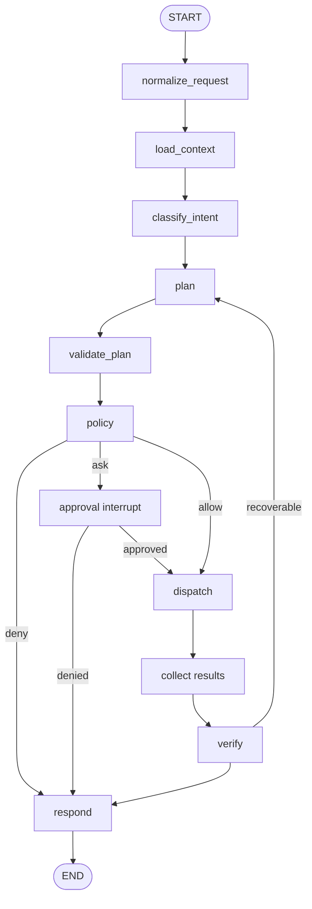

# LangGraph Architecture

## Design rules

- Nodes return state deltas; reducers are explicit.
- The graph owns workflow state, not open sockets or native handles.
- Planning may fan out read-only specialists. Side effects use a dependency-ordered lane.
- Every run has stable `task_id` and LangGraph `thread_id`.
- Production uses a durable PostgreSQL checkpointer.
- Dynamic `interrupt()` is the approval mechanism. Interrupt payloads are JSON-serializable.
- Code before an interrupt is pure or idempotent because its node restarts on resume.
- Side effects live after approval in separate nodes.
- Recursion, retries, plan revisions, tokens, time, and cost are bounded.

## Routing

Deterministic routing handles contract validity, risk, availability, and status. A model may recommend an agent but cannot override routing constraints. Unknown intent routes to clarification or safe response, never a general-purpose terminal.

## Specialist subgraphs

Coding, desktop, Git, Docker, browser, research, memory, voice, and vision specialists produce observations or proposed actions under narrow schemas. They do not grant one another permissions. Use subgraphs when a domain needs its own state and evaluation set, not merely to create impressive diagrams.

## Recovery

Transient read failures retry with jitter. Side-effect retry requires idempotency support and reconciliation. A plan can be revised at most twice automatically. Resume uses the same thread and an approval payload bound to the pending interrupt.

## Evaluation hooks

Capture intent correctness, plan validity, unnecessary actions, policy agreement, tool selection, verification quality, latency, cost, and user correction. Store sanitized datasets separately from production personal memory.
