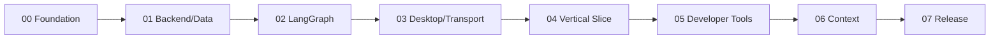

# Delivery Sequence

## Stage 00 — Foundation

Create repository structure, pinned toolchains, contracts, fake executor, configuration model, security baseline, and CI skeleton.

Gate: Python and C# parse the same golden action/event fixtures.

## Stage 01 — Backend and data

Create FastAPI lifecycle, `jarvis` schema migrations, task/event persistence, outbox, health endpoints, and tests.

Gate: task creation and event replay survive backend restart.

## Stage 02 — LangGraph

Implement typed state, planner, deterministic validation/policy routing, durable checkpointing, interrupt/resume, bounded dispatch, and verification.

Gate: fake-executor workflows cover allow, ask, deny, cancel, duplicate, timeout, and restart.

## Stage 03 — Desktop

Create WPF shell, device identity, authenticated transport, capability manifest, local policy, executor receipts, and approval UI.

Gate: changed/expired approvals and duplicate actions are rejected locally.

## Stage 04 — Vertical slice

Register a project and execute “continue project”: inspect Git, preview plan, open VS Code, start declared services, check health, report.

Gate: clean, dirty, offline, partial failure, cancellation, and crash recovery pass in a Windows VM.

## Stage 05 — Developer tools

Add scoped patching, terminal specifications, Git mutations, Docker lifecycle, tests, and diagnostics.

Gate: no work escapes project roots or mutates remotes without exact approval.

## Stage 06 — Context

Add consented memory, project RAG, request-scoped UIA/OCR, and opt-in voice.

Gate: ACL, deletion, prompt-injection, recording indicator, and privacy tests pass.

## Stage 07 — Release

Add plugin isolation, telemetry, migration rehearsal, signed packaging/update, SBOM, accessibility, performance, and staged rollout.

Gate: release checklist and recovery drill are signed off.
